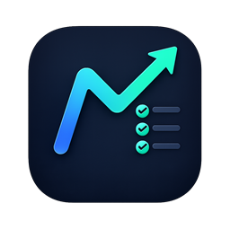
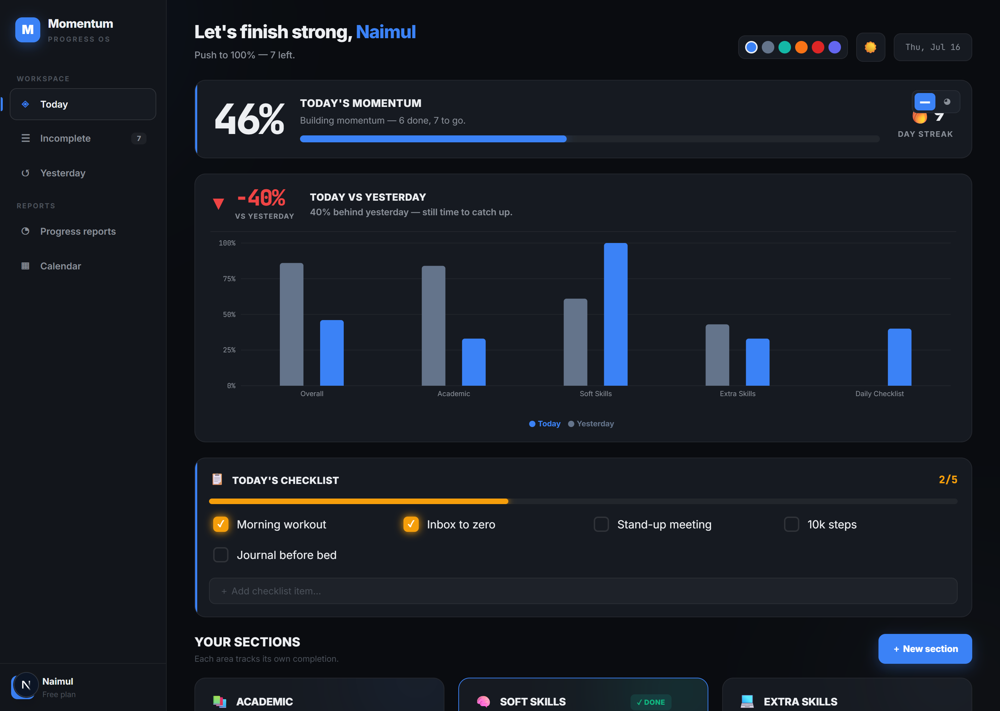
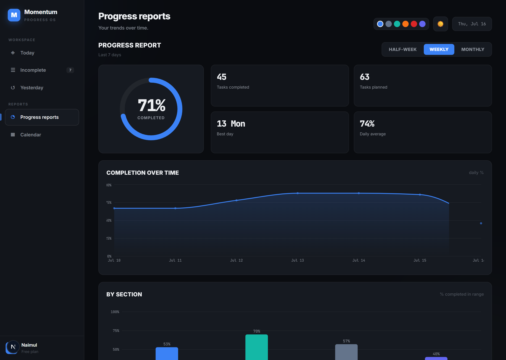
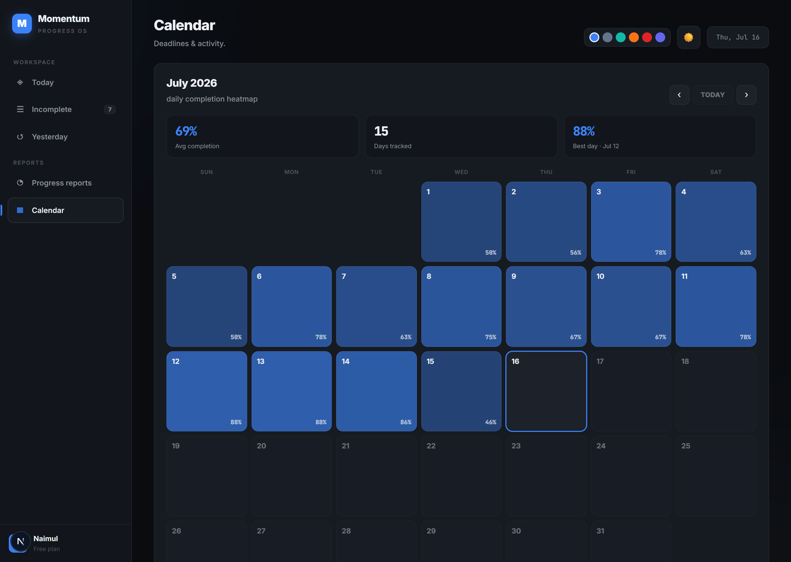
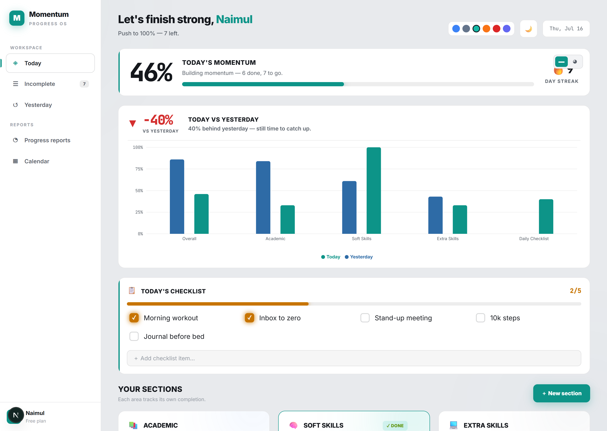

<div align="center">



# Momentum — Progress OS

**A local-first daily progress & task tracker that's built to help you _finish_, not just make lists.**

Organize your day into the areas that matter, watch your momentum climb toward 100%, time your work, and see whether you're actually improving — all running privately on your own machine.


</div>

<p align="center">
  
</p>

---

## Why Momentum?

There are hundreds of task trackers. Most of them fall into one of two traps: they're either a bare checklist that forgets _why_ you opened it, or a bloated SaaS that wants your email, your data, and a monthly fee. **Momentum is different on purpose:**

- 🔒 **100% private & local-first.** No account. No cloud. No tracking. Your data is stored on _your_ device and never leaves it. Delete the app and it's gone — you own it completely.
- 🔌 **Works fully offline.** Install the desktop app and use it on a plane, in a cabin, anywhere. No server, no internet required.
- 📈 **Designed around finishing, not listing.** A live **momentum meter** pushes you toward 100%, a **day streak** rewards consistency, and a **Today-vs-Yesterday** view tells you the one thing most trackers hide: _are you actually getting better?_
- ⏱️ **Time-aware.** Give any task a scheduled window (with an overdue nudge) and a **built-in stopwatch** to see where your hours really go.
- 🗺️ **Insight, not just data.** Weekly/monthly reports, a per-section breakdown, and a GitHub-style **completion heatmap calendar** turn your days into trends.
- 🎨 **Fast, focused, and genuinely nice to use.** A professional dark UI (with light mode + 6 accent colors), smooth micro-interactions, and encouraging nudges when you hit milestones.
- 🆓 **Free and open.** No paywalls, no "premium" tier holding your own productivity hostage.

> **In one line:** the privacy of a local file, the polish of a modern SaaS, and a UX that's actually engineered to keep your momentum going.

---

## Features

### Plan & do — the **Today** screen
- **Customizable sections** (life areas like Academic, Work, Health) — each with its own emoji, accent color, and completion %.
- **Momentum meter** with a switchable **bar ↔ ring** view, motivating messages, and a 🔥 **day streak**.
- **Daily Checklist** — a recurring quick-list that resets every day and feeds your overall momentum.
- **Per-task scheduling** — optional start–end time window with an **overdue** flag.
- **Per-task stopwatch** — start / pause / reset to track real time spent; auto-pauses when you complete a task.
- **Today vs Yesterday** — a comparison chart so progress is undeniable.

### Understand — reports & history
- **Incomplete** — every open task across all sections in one place.
- **Yesterday** — how yesterday finished, overall and per section.
- **Progress reports** — Half-week / Weekly / Monthly gauge, key stats, a completion-over-time chart, and per-section bars.
- **Calendar** — a monthly **completion heatmap** with navigation, month stats, and click-a-day breakdowns.

### Delight
- **Motivational toasts** on milestones (50% / 75% / perfect day / section cleared).
- **Themes** — dark (default) & light, plus **6 accent colors** that recolor the entire app.
- **Responsive** — desktop sidebar collapses into a mobile bottom nav.

<p align="center">
  
  
</p>
<p align="center">
  
</p>

---

## Tech stack

| Layer | Choice |
| --- | --- |
| Framework | [Next.js 16](https://nextjs.org) (App Router) + TypeScript |
| Styling | Tailwind CSS v4 + CSS variables (theming) |
| Charts | [Recharts](https://recharts.org) |
| Desktop | [Electron](https://www.electronjs.org) + [electron-builder](https://www.electron.build) |
| Data | `localStorage` — local-first, zero backend |

The app is a fully client-side SPA, which is exactly what makes it private, offline-capable, and trivial to ship as a desktop binary.

---

## Getting started (development)

```bash
git clone https://github.com/akib-naimul/Daily-Progress-Task-Tracker-Momentum.git
cd Daily-Progress-Task-Tracker-Momentum
npm install
npm run dev
```

Open <http://localhost:3000>.

---

## 🖥️ Desktop app

### For users — just download & run
Grab the latest **`Momentum Setup.exe`** from the [**Releases**](../../releases) page, run it, and you're done — no Node, no setup, no internet. Your data stays on your PC.

> First launch may show a Windows SmartScreen prompt (the app isn't code-signed). Click **More info → Run anyway**.

### For developers — build the installer

```bash
npm run desktop:build      # → dist/Momentum Setup <version>.exe
```

Or just launch the desktop app locally without packaging:

```bash
npm run desktop:dev
```

**How it works:** `desktop:build` statically exports the app (`BUILD_TARGET=desktop next build` → `out/`), then `electron-builder` packages it. Electron serves the exported files through a secure custom `app://` origin, so assets, favicon, and `localStorage` all behave exactly like the web version. See [`electron/main.js`](electron/main.js) and [`next.config.ts`](next.config.ts).

---

## Privacy & your data

Momentum stores everything in your browser's / app's local storage on your device:

- **No account, no sign-in, no server, no analytics.**
- Your tasks, timers, and history **never leave your machine**.
- The web and desktop versions each keep their own local data (they don't sync to each other or the cloud).

---

## Roadmap

- [x] Export / import your data (JSON backup)
- [x] Automated Windows installer builds via GitHub Actions
- [ ] Optional IndexedDB storage for larger histories
- [ ] Auto-update for the desktop app
- [ ] macOS & Linux desktop builds
- [ ] Optional end-to-end-encrypted sync (opt-in, still private)

---

## Project structure

```
src/
  app/            layout, global styles, entry page
  lib/            data model, localStorage store, helpers, hooks
  components/     Today, Incomplete, Yesterday, Reports, Calendar, and shared UI
electron/
  main.js         Electron main process (serves the exported app)
  icon.ico        app icon
next.config.ts    web + desktop (static export) config
```

---

## License

Released under the [MIT License](LICENSE) — free to use, modify, and share.

<div align="center">

**Built with focus by [Naimul](https://github.com/akib-naimul).** ⚡
If Momentum helps you finish your day, consider giving it a ⭐.

</div>
